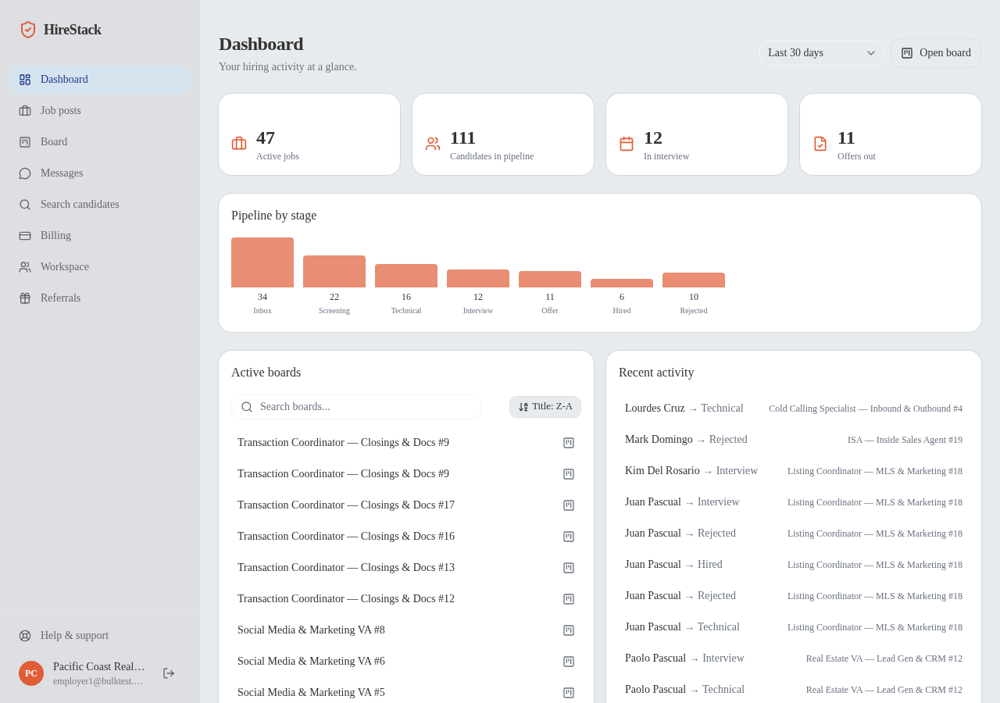
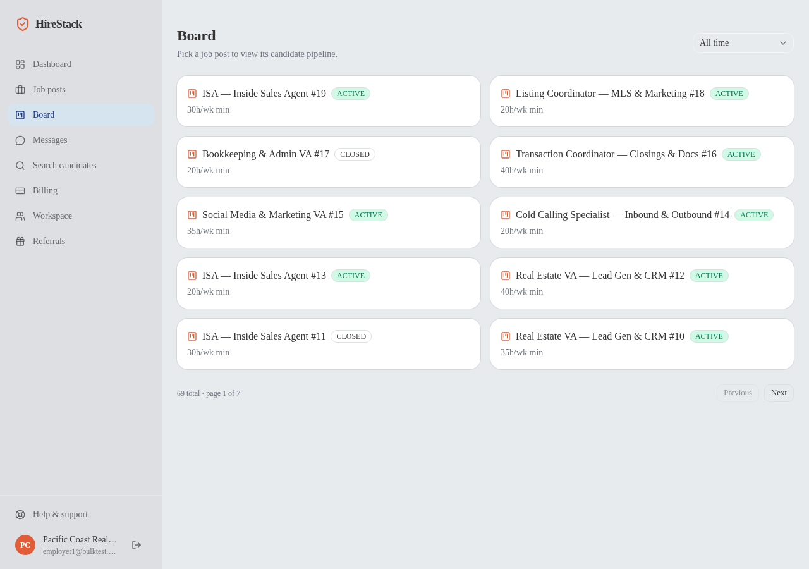
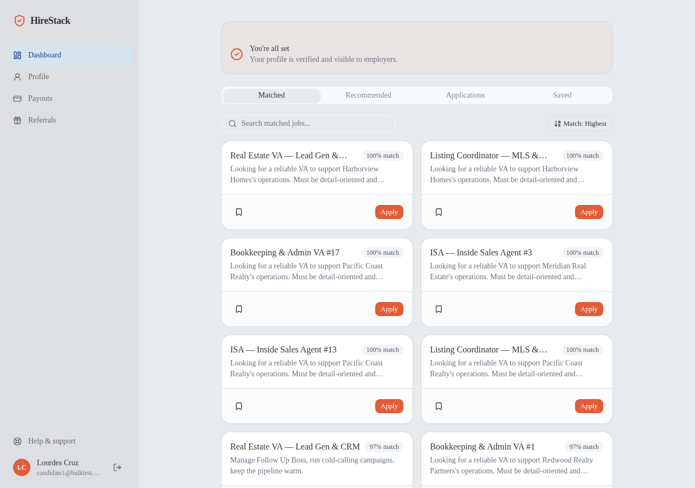
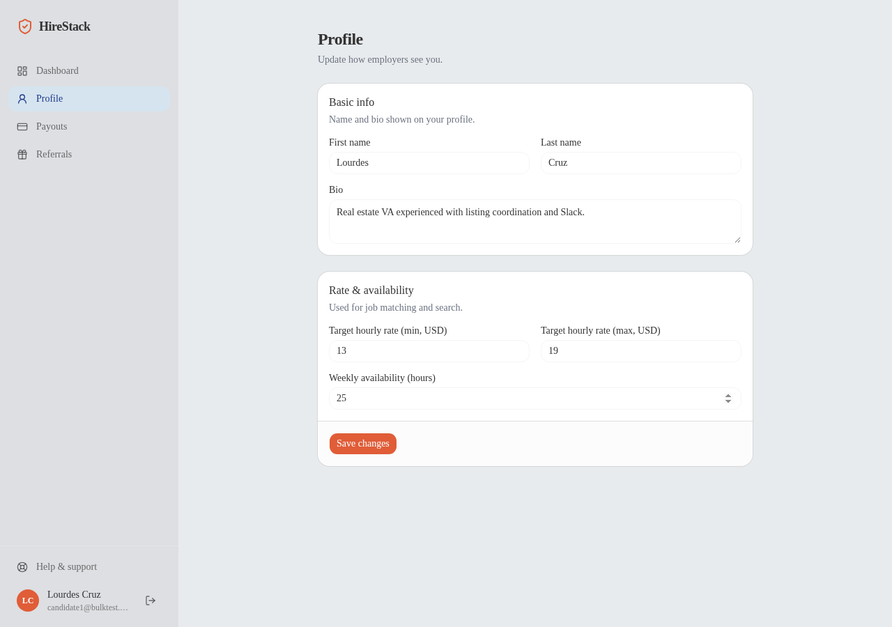

# HireStack

A hiring marketplace that connects overseas virtual assistants with real estate teams —
built end-to-end as a real product, not a portfolio toy.

**[Live demo →](https://hire-stack-tan.vercel.app/)** — demo login buttons for
candidate / employer / admin are right on the sign-in page, pre-loaded with a real
profile, real jobs, applications at every pipeline stage, and a payment sitting in escrow.

**Status: under active development.**

## What it actually does

- **Upload a résumé, get a verified profile.** AI reads the résumé and pulls out work
  history and skills. Anything unclear gets flagged and double-checked by a human before
  the profile goes live — no fake "AI approved you" moment, no black box.
- **Search that understands what you mean.** Type "someone who's managed a team of
  leasing agents" and get real matches, not just keyword hits. Same tech also powers
  candidate recommendations, a chat you can ask questions about a candidate, and
  smarter admin reviews — all backed by real answers pulled from real data, with sources
  shown, not guessed.
- **Real payments, held safely.** Employers fund a job, money sits in escrow, and it
  only releases once both sides sign off. This isn't a "pay now" button, it's an actual
  marketplace payment flow.
- **A hiring pipeline that works like one.** Drag-and-drop candidate board, match
  scoring per job (not just a vague profile score), pipeline stats, and an audit trail
  admins can actually read.
- **Live updates, not refresh-and-pray.** Messages and pipeline changes show up
  instantly.

## Screenshots

| | |
|---|---|
|  Employer dashboard |  Candidate pipeline board |
|  Candidate matched jobs |  Candidate profile |

## Why these decisions

A few product/architecture calls worth calling out, since they're the interesting part:

- **The publish gate is derived, not a button.** A candidate profile becomes searchable
  automatically the moment it has zero unresolved employment anomalies — there's no
  separate "admin approves candidate" step. Verification is a state, not an action.
- **Ambiguity detection is a deterministic rule pass, not an LLM judgment call.** The AI's
  only job is structured extraction from the résumé; a rules engine decides what counts
  as suspicious (gaps, wage mismatches, unverifiable software claims), so the same input
  always produces the same flag.
- **Match score is per job post, not per profile.** A candidate doesn't have one global
  score — they have a different score against every job they could apply to, computed
  from a weighted formula (skills, software, industry, availability).
- **Kanban stages are fully free-form.** No workflow enforcement, no illegal transitions.
  Recruiters move candidates back out of "Rejected" all the time in real life — the tool
  shouldn't fight that.

## Stack

Next.js (App Router) · tRPC · PostgreSQL (Neon) + pgvector + Prisma · BetterAuth ·
NVIDIA NIM (AI extraction + embeddings, provider-agnostic via env vars) · Stripe +
Stripe Connect · Cloudflare R2 · shadcn/ui.

## Local setup

1. **Install dependencies**
   ```bash
   pnpm install
   ```

2. **Database — [Neon](https://neon.tech) (free tier)**
   Create a project, copy the pooled connection string into `.env` as `DATABASE_URL`.

3. **Auth — [BetterAuth](https://better-auth.com)**
   Generate a secret: `openssl rand -base64 32` → `BETTER_AUTH_SECRET` in `.env`.

4. **AI extraction + embeddings — [NVIDIA NIM](https://build.nvidia.com) (free tier)**
   Sign up, grab an API key from any model page (e.g. DeepSeek-V3 or GLM) → `AI_API_KEY`.

5. **File storage — [Cloudflare R2](https://developers.cloudflare.com/r2/) (free tier)**
   Create a bucket, an API token with R2 read/write, fill in `R2_*` vars.

6. **Billing — [Stripe](https://dashboard.stripe.com) (test mode)**
   `STRIPE_SECRET_KEY` from the dashboard; `STRIPE_WEBHOOK_SECRET` from `stripe listen` locally.
   Connect (marketplace pay-through) needs its own webhook secret — see `.env.example`.

7. **Copy env and fill in the values above**
   ```bash
   cp .env.example .env
   ```

8. **Push the schema and generate the client**
   ```bash
   pnpm db:migrate
   ```

9. **Seed demo data (optional, recommended)**
   ```bash
   pnpm db:seed        # base taxonomy (industries/software/skills)
   pnpm tsx prisma/seed-demo.ts   # three demo personas + full pipeline data
   ```

10. **Run**

    ```bash
    pnpm dev
    ```
